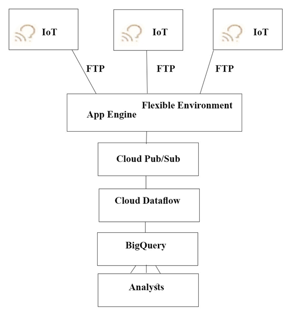
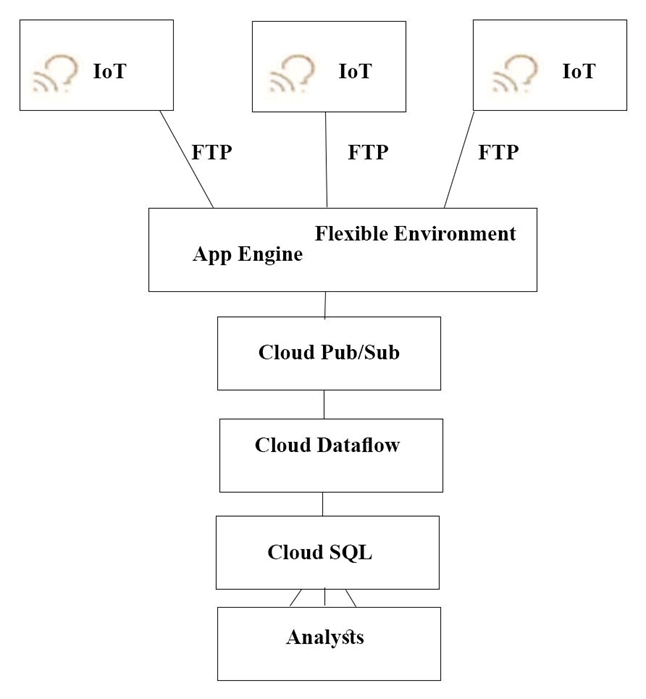

Introductory Info

**Company Overview -**
TerramEarth manufactures heavy equipment for the mining and agricultural industries: about 80% of their business is from mining and 20% from agriculture. They currently have over 500 dealers and service centers in 100 countries. Their mission is to build products that make their customers more productive.

**Company background -**
TerramEarth was formed in 1946, when several small, family owned companies combined to retool after World War II. The company cares about their employees and customers and considers them to be extended members of their family.
TerramEarth is proud of their ability to innovate on their core products and find new markets as their customers' needs change. For the past 20 years, trends in the industry have been largely toward increasing productivity by using larger vehicles with a human operator.

**Solution Concept -**
There are 20 million TerramEarth vehicles in operation that collect 120 fields of data per second. Data is stored locally on the vehicle and can be accessed for analysis when a vehicle is serviced. The data is downloaded via a maintenance port. This same port can be used to adjust operational parameters, allowing the vehicles to be upgraded in the field with new computing modules.
Approximately 200,000 vehicles are connected to a cellular network, allowing TerramEarth to collect data directly. At a rate of 120 fields of data per second with 22 hours of operation per day, Terram Earth collects a total of about 9 TB/day from these connected vehicles.

**Existing Technical Environment -**

TerramEarth's existing architecture is composed of Linux-based systems that reside in a data center. These systems gzip CSV files from the field and upload via
FTP, transform and aggregate them, and place the data in their data warehouse. Because this process takes time, aggregated reports are based on data that is 3 weeks old.
With this data, TerramEarth has been able to preemptively stock replacement parts and reduce unplanned downtime of their vehicles by 60%. However, because the data is stale, some customers are without their vehicles for up to 4 weeks while they wait for replacement parts.

**Business Requirements -**
Decrease unplanned vehicle downtime to less than 1 week, without increasing the cost of carrying surplus inventory
Support the dealer network with more data on how their customers use their equipment to better position new products and services
Have the ability to partner with different companies "" especially with seed and fertilizer suppliers in the fast-growing agricultural business "" to create compelling joint offerings for their customers.

**CEO Statement -**
We have been successful in capitalizing on the trend toward larger vehicles to increase the productivity of our customers. Technological change is occurring rapidly, and TerramEarth has taken advantage of connected devices technology to provide our customers with better services, such as our intelligent farming equipment. With this technology, we have been able to increase farmers' yields by 25%, by using past trends to adjust how our vehicles operate. These advances have led to the rapid growth of our agricultural product line, which we expect will generate 50% of our revenues by 2020.

**CTO Statement -**
Our competitive advantage has always been in the manufacturing process, with our ability to build better vehicles for lower cost than our competitors. However, new products with different approaches are constantly being developed, and I'm concerned that we lack the skills to undergo the next wave of transformations in our industry. Unfortunately, our CEO doesn't take technology obsolescence seriously and he considers the many new companies in our industry to be niche players. My goals are to build our skills while addressing immediate market needs through incremental innovations.
Question
TerramEarth's CTO wants to use the raw data from connected vehicles to help identify approximately when a vehicle in the field will have a catastrophic failure.
You want to allow analysts to centrally query the vehicle data.
Which architecture should you recommend?

A) 
B) 
C) 
D) 
----
A
